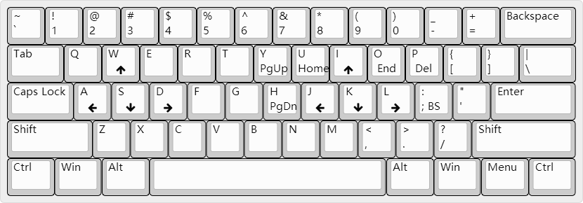

# CapsLock

## 介绍
Caps 键与 Shift 键功能重复，因此可以利用 Caps 组合其它键实现常用操作映射。所有组合键都可以在[标准指法](https://baike.baidu.com/item/%E6%A0%87%E5%87%86%E6%8C%87%E6%B3%95)下轻松按到，尤其适合开发人员，和 60% 键盘更配。

## 功能

## 使用
下载后免安装直接可用，建议添加到开机启动，win10 将软件放到文件夹`%USERPROFILE%\AppData\Roaming\Microsoft\Windows\Start Menu\Programs\Startup`下即可。

未完待续

## 下载
[CapsLock](https://raw.githubusercontent.com/Liy1eE/capslock/master/CapsLock.exe)
